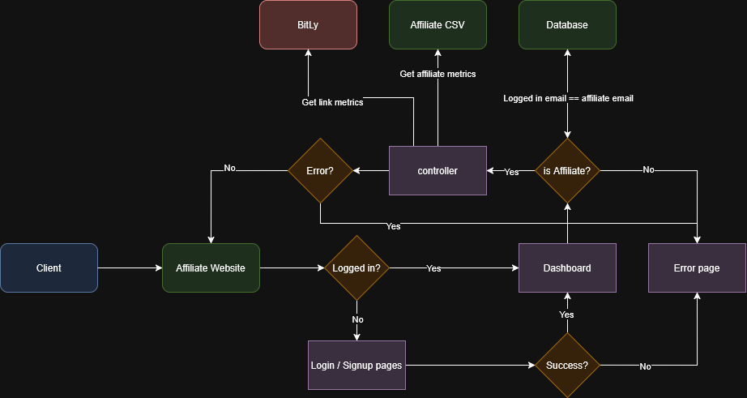
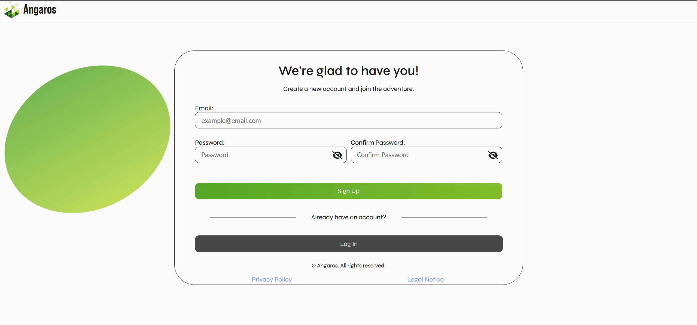
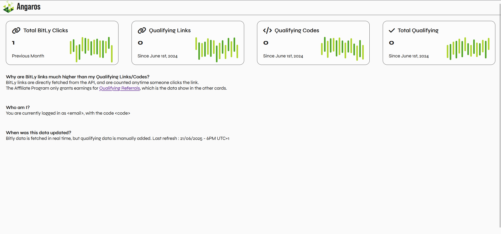

# Salad's Affiliate Website
> Welcome, affiliate friend!

If you are a Salad Affiliate - then you've likely wanted to see your metrics during the month. This project aims to show your curent progression in the affiliate program.

**Note:** The website is currently available at https://affiliates.angaros.xyz/

## Installing / Getting started :beginner:

In order to host the website, the following items are required to be done:
1. Clone the repository
   ```bash
   git clone https://github.com/AngarosGamer/AffiliateWebsite.git
   cd AffiliateWebsite
   ```

2. Create and initialise the venv
   ```bash
   python -m venv .venv
   source .venv/bin/activate
   ```
3. Initialise the database:
   ```bash
   sqlite3 database/database.db < database/create.sql
   ```
   If you know who are the affiliates, run :
   ```bash
   sqlite3 database/database.db < database/fill_affiliates.sql
   ```
4. Install dependencies :
   ```bash
   pip install -r requirements.txt
   ```
5. Add secrets:
   ```bash
   nano .env
    ```
   Add :
   ```bash
   SECRET_KEY=<your_secret_key>
   BITLY_API=<your_bitly_api_key>
   ```
   Save & exit.
6. Transfer the Affiliate data from Salad:
   ```bash
   nano affiliate-codes.csv
   nano affiliate-links.csv
   ```
7. Start the website
   ```bash
    python ./app.py
   ```
## Permissions & Security :lock:

The Affiliate Website works as follows:


As you may be able to see, the security relies on an administrator adding affiliates to the database, and assuming that a user account has already been created within.

## Examples 




## Contributing :heart:

Do you like this project and want to contribute to it? Suggestions, fixes, and comments are welcome!

In order to contribute, please open an issue and provide detail about your comment using the following format:

- Title:
```bash
[bug|suggestion|comment] A summarized description of your issue
```
Pick one between bug, suggestion, or comment.

- Content:
```bash
[Version] : Add your version here
[Observed] : Explain what behavior you are seeing
[Expected] : Explain what you were expecting to happen
[Attempted] : Have you attempted any debugging steps? Has anything worked?
[Additional] : Anything else that can help us?
```
Try to fill in all fields to give us context! You can omit tags that don't apply, for example `Attempted` in the case of a `suggestion` might not be required.

**Are you more technically inclined?**<br>
If you're comfortable with the project, you're welcome to directly submit a pull request.

Make sure to include all relevant information about what the request aims to achieve, actually does, or anything relevant for our review. We may contact you if more information is required.

## Salad? Affiliates? :link:

Salad is a distributed Cloud computing platform - users can earn balance by contributing their machine's computing power to our paying customers.<br>
Learn more here: https://salad.com/

Salad has an affiliate program, allowing you to earn from the amount of users you share your link with. :smile:!<br>
https://salad.com/affiliate

## Licensing :scroll:

This project and its code is protected by an MIT license. You can find a text version of this license in this repository under the LICENSE file, or by using GitHub's "MIT license" tab.